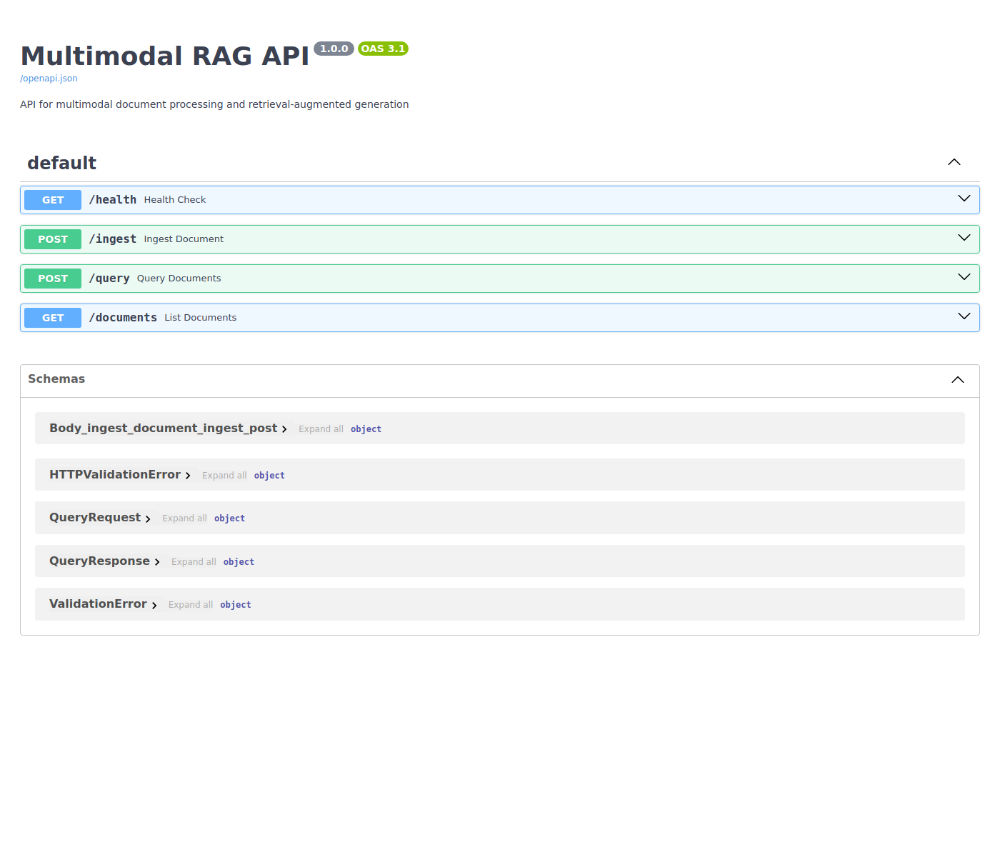
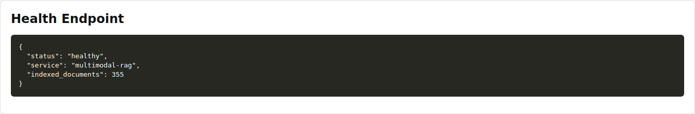
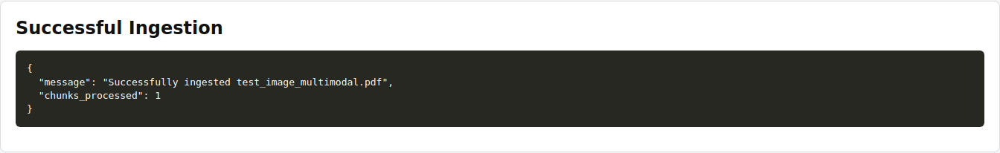
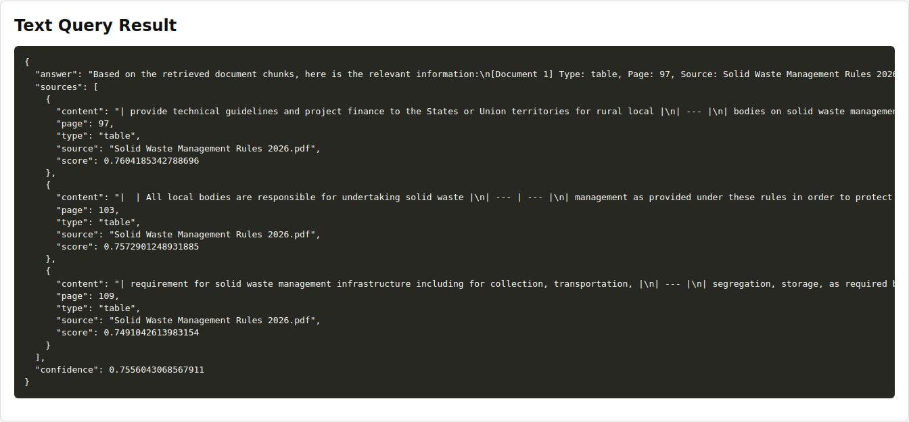
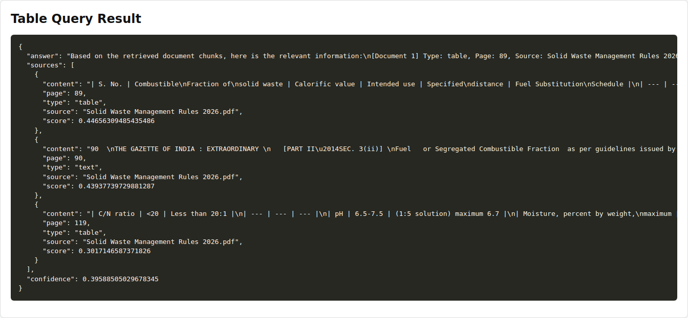
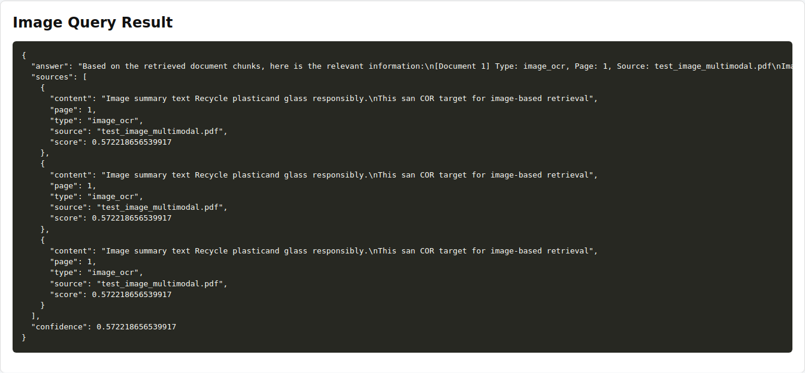

# Bootcamp-Assignment-Multimodal-RAG-2024TM05010

Bootcamp Assignment from WILP, BITS Pilani, Hyderabad Campus on Multimodal RAG

# Multimodal RAG for Sustainability

A comprehensive FastAPI-based system for processing multimodal PDF documents and performing retrieval-augmented generation (RAG) queries. The system can ingest PDFs containing text, tables, and images, build searchable vector indexes, and provide intelligent Q&A capabilities.

## Problem Statement

- **Domain:** Sustainability
- **Problem:** Derive actionable, audit-ready context from long multimodal sustainability documents (permits, monitoring reports, EHS manuals, design drawings). Misreading thresholds, tables, or diagrams can cause environmental non-compliance and legal exposure.

## Documents and Query Challenges

- **Types:** regulatory permits, monitoring tables, process diagrams, SOPs, sustainability reports.
- **Why hard:** critical facts split across text, tables, images, and footnotes; specialized units/averaging rules; dense legal language and cross-references that break keyword search.

## What Makes It Unique

- Domain jargon, numeric semantics (units, averaging), regulatory provenance needs, multimodal evidence (figures/diagrams), and high cost of errors distinguish this from generic document Q&A.

## Why RAG

- Retrieval supplies up-to-date, sourceable context (exact clause/table/figure) to the LLM, enabling grounded answers with citations without costly retraining; multimodal embeddings let the system surface images and table rows as evidence.

## Expected Outcomes

- Concise, citation-backed answers to compliance queries (e.g., permit limits, sampling protocols, applicable clauses), faster audit reviews, and decision support for mitigation and reporting.

## Features

- **Multimodal PDF Processing**: Extracts text, tables, and images from PDF documents
- **Vector Indexing**: Supports both FAISS and ChromaDB for efficient similarity search
- **OCR Integration**: Uses Tesseract OCR for image text extraction
- **CLIP Embeddings**: Leverages OpenAI CLIP for image understanding
- **RAG Pipeline**: Combines retrieval and generation for accurate answers
- **RESTful API**: FastAPI-based endpoints for document ingestion and querying
- **Swagger UI**: Interactive API documentation

## Architecture

### System Overview

```mermaid
graph LR
  A[PDF Documents] --> B[Ingestion Pipeline]
  B --> C[PDF Processor]
  C --> D[Text Extraction]
  C --> E[Table Extraction]
  C --> F[Image OCR / CLIP]
  D --> G[Vector Store]
  E --> G
  F --> G
  G --> H[Retrieval Engine]
  H --> I[RAG Pipeline]
  I --> J[FastAPI / REST API]
  J --> K[/docs Swagger UI]
  J --> L[/query and /health endpoints]
  style A fill:#f9f,stroke:#333,stroke-width:1px
  style G fill:#bbf,stroke:#333,stroke-width:1px
  style I fill:#bfb,stroke:#333,stroke-width:1px
  style J fill:#ffb,stroke:#333,stroke-width:1px
```

### Ingestion Pipeline

- `POST /ingest` uploads a PDF document
- `PDF Processor` extracts text, tables, and images
- Text and table chunks are embedded using sentence-transformers
- Image/OCR chunks use OCR and optional CLIP embeddings
- All chunks are stored in the vector store (FAISS or ChromaDB)

### Query Pipeline

- `POST /query` sends a natural-language question
- `Retrieval Engine` searches the vector store for relevant chunks
- `RAG Pipeline` formats retrieved context and calls the LLM
- Response includes answer, source snippets, document metadata, and confidence

## Installation

1. **Clone the repository**
   ```bash
   git clone <repository-url>
   cd Bootcamp-Assignment-Multimodal-RAG-2024TM05010
   ```

2. **Create virtual environment**
   ```bash
   python -m venv venv
   source venv/bin/activate  # On Windows: venv\Scripts\activate
   ```

3. **Install dependencies**
   ```bash
   pip install -r requirements.txt
   ```

4. **Install Tesseract OCR** (required for image processing)
   ```bash
   # Ubuntu/Debian
   sudo apt-get install tesseract-ocr

   # macOS
   brew install tesseract

   # Windows: Download from https://github.com/UB-Mannheim/tesseract/wiki
   ```

5. **Configure environment variables**
   ```bash
   cp .env.example .env
   # Edit .env with your OpenAI API key and other settings
   ```

## Configuration

Key configuration options in `.env`:

- `VECTOR_STORE_TYPE`: Choose between `faiss` (faster, in-memory) or `chromadb` (persistent)
- `EMBEDDING_MODEL`: Text embedding model (default: sentence-transformers/all-MiniLM-L6-v2)
- `LLM_MODEL`: OpenAI model for generation (default: gpt-3.5-turbo)
- `OPENAI_API_KEY`: Your OpenAI API key (required)

## Usage

### Start the Server

```bash
uvicorn app.main:app --reload --host 0.0.0.0 --port 8000
```

Visit `http://localhost:8000/documentation` for interactive Swagger UI documentation, or `http://localhost:8000/docs` for a JSON summary of available endpoints.

### API Endpoints

#### Health Check
```http
GET /health
```

#### Ingest Document
```http
POST /ingest
Content-Type: multipart/form-data

file: <PDF file>
```

#### Query Documents
```http
POST /query
Content-Type: application/json

{
  "query": "What are the main rules for solid waste management?",
  "top_k": 5
}
```

#### List Documents
```http
GET /documents
```

#### API Documentation
```http
GET /docs
```

### Example Usage

1. **Ingest a PDF**:
   ```bash
   curl -X POST "http://localhost:8000/ingest" \
        -H "accept: application/json" \
        -H "Content-Type: multipart/form-data" \
        -F "file=@Solid Waste Management Rules 2026.pdf"
   ```

2. **Query the system**:
   ```bash
   curl -X POST "http://localhost:8000/query" \
        -H "Content-Type: application/json" \
        -d '{
          "query": "What are the penalties for improper waste disposal?",
          "top_k": 3
        }'
   ```

## Screenshots

### API Documentation


### Health Check Response


### Document Ingestion


### Text Query Response


### Table Query Response


### Image Query Response


## Project Structure

```
├── app/
│   ├── main.py              # FastAPI application
│   ├── config.py            # Configuration settings
│   ├── services/
│   │   ├── pdf_processor.py # PDF processing logic
│   │   ├── vector_store.py  # Vector indexing and search
│   │   └── rag_pipeline.py  # RAG query processing
│   └── __init__.py
├── data/                    # Vector store data (created automatically)
├── requirements.txt         # Python dependencies
├── .env.example            # Environment configuration template
├── README.md               # This file
└── Solid Waste Management Rules 2026.pdf  # Sample document
```

## Technologies Used

- **FastAPI**: Modern Python web framework
- **PyMuPDF**: PDF text and image extraction
- **pdfplumber**: Table extraction from PDFs
- **Tesseract OCR**: Optical character recognition
- **Sentence Transformers**: Text embeddings
- **CLIP**: Multimodal embeddings (text + images)
- **FAISS/ChromaDB**: Vector similarity search
- **OpenAI GPT**: Language model for generation
- **Pillow**: Image processing

## Deployment

### Docker Deployment

1. **Build the image**:
   ```bash
   docker build -t multimodal-rag .
   ```

2. **Run the container**:
   ```bash
   docker run -p 8000:8000 -e OPENAI_API_KEY=your_key_here multimodal-rag
   ```

### Cloud Deployment

The application can be deployed to:
- **AWS**: Using Elastic Beanstalk or ECS
- **Google Cloud**: Using Cloud Run or GKE
- **Azure**: Using Container Instances or AKS

## Testing

Run the included test document:
```bash
python -c "
import requests
# Ingest document
with open('Solid Waste Management Rules 2026.pdf', 'rb') as f:
    requests.post('http://localhost:8000/ingest', files={'file': f})

# Query
response = requests.post('http://localhost:8000/query', json={'query': 'What is solid waste?'})
print(response.json())
"
```

## Limitations & Future Work

- **Limited legal reasoning:** The current pipeline retrieves and summarizes chunks, but it does not reliably perform deep legal interpretation, liability assessment, or regulatory judgment.
- **OCR and image accuracy:** Image OCR and diagram interpretation are basic. Complex diagrams, handwritten notes, and scanned tables may be misread or omitted.
- **Table semantics:** Table extraction converts tabular data to markdown text, which can lose structure, units, and aggregation rules needed for precise compliance answers.
- **No provenance guarantees:** The system returns retrieved snippets, but it does not yet provide formal citation formatting, audit trails, or provenance validation required for regulatory submission.
- **Model dependency:** The answer quality depends on the embedding and LLM models in use. Off-the-shelf models may hallucinate or over-generalize if retrieval context is weak.
- **Performance and scale:** FAISS in-memory indexing is fine for small collections, but large permit sets and historical archives would need persistent, shardable vector storage and batch ingestion.

### Future improvements

- Add structured table parsing and numeric normalization so thresholds, averaging rules, and units are handled consistently.
- Improve multimodal extraction by adding diagram understanding, table bounding-box context, and layout-aware document parsing.
- Implement provenance tracking for clause-level citations, source document links, and evidence confidence scores.
- Add domain-specific compliance validation rules, such as permit limit checks, sampling frequency auditing, and exception detection.
- Support incremental ingestion, document versioning, and persistent vector store backups for audit-ready operations.

## Contributing

1. Fork the repository
2. Create a feature branch
3. Make your changes
4. Add tests if applicable
5. Submit a pull request

## License

This project is part of an academic assignment for BITS Pilani WILP program.
